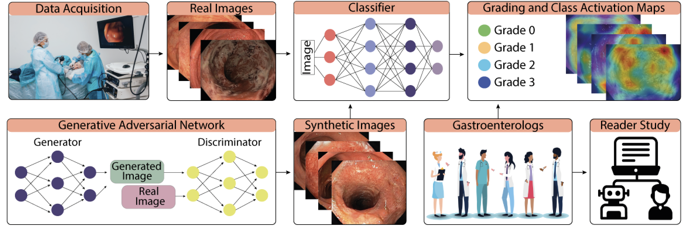
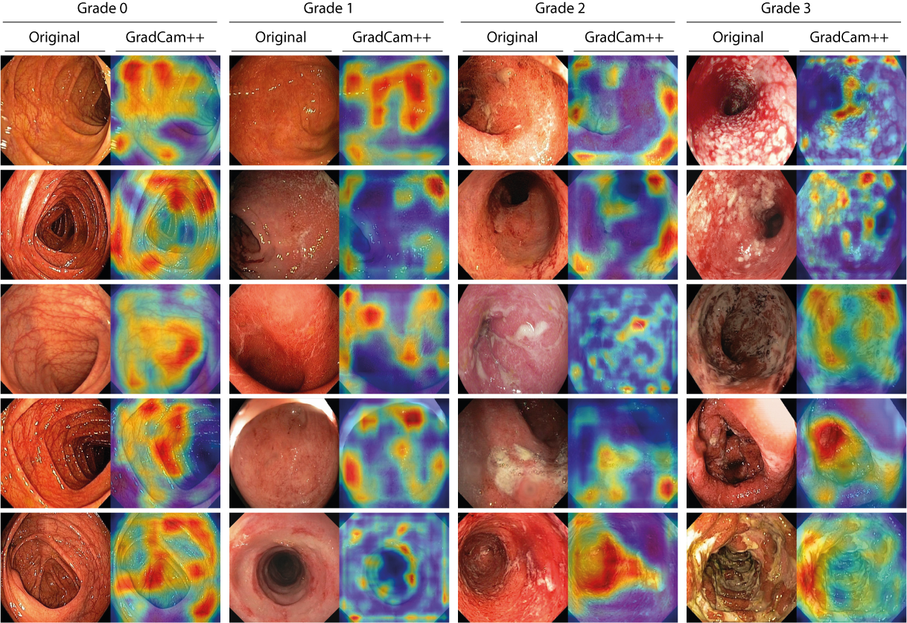

# ulcer_classification-Title



### [Paper]() |  [Dataset]() | [Pretrained Models]() | [WebSite](https://deepmia.boun.edu.tr/) 

In this work, we proposed .....

## Example Results

### Grad-CAM++ with Real Images


### Real and Synthetic Images


## Prerequisites
- Linux or macOS
- Python 3
- CPU or NVIDIA GPU + CUDA CuDNN


### Getting started

- Clone this repo:
```bash
git clone https://github.com/DeepMIALab/Ulcer_grade_classificaiton
cd Ulcer_grade_classificaiton
```

- Install PyTorch 3.7 and other dependencies (e.g., torchvision, visdom, dominate, gputil).

- For pip users, please type the command `pip install -r requirements.txt`.

- For Conda users,  you can create a new Conda environment using `conda env create -f environment.yml`.

### Training and Test

- The image identity numbers which were used in train, validation and test sets are given as .txt files in [docs/](https://github.com/DeepMIALab/AI-FFPE/tree/main/docs) for both Brain and Lung dataset. To replicate the results, you may download [dataset]() projects for Lung from TCGA Data Portal and create a subset using these .txt files.

The data used for training are expected to be organized as follows:
```bash
Data_Path                # DIR_TO_TRAIN_DATASET
 ├──  train
 |      ├──Grade_0
 |           ├── 1.png     
 |           ├── ...
 |           └── n.png
 |      ├──Grade_1
 |           ├── 1.png     
 |           ├── ...
 |           └── n.png
 |      ├──Grade_2
 |           ├── 1.png     
 |           ├── ...
 |           └── n.png
 |      ├──Grade_3
 |           ├── 1.png     
 |           ├── ...
 |           └── n.png
 ├──  test
 |      ├──Grade_0
 |           ├── 1.png     
 |           ├── ...
 |           └── n.png
 |      ├──Grade_1
 |           ├── 1.png     
 |           ├── ...
 |           └── n.png
 |      ├──Grade_2
 |           ├── 1.png     
 |           ├── ...
 |           └── n.png
 |      ├──Grade_3
 |           ├── 1.png     
 |           ├── ...
 |           └── n.png

```

- To view training results and loss plots, run `python -m visdom.server` and click the URL http://localhost:8097.

- Train the AI-FFPE model:
```bash
python train.py --dataroot ./datasets/Frozen/${dataroot_train_dir_name} --name ${model_results_dir_name} --CUT_mode CUT --batch_size 1
```

- Test the AI-FFPE  model:
```bash
python test.py --dataroot ./datasets/Frozen/${dataroot_test_dir_name}  --name ${result_dir_name} --CUT_mode CUT --phase test --epoch ${epoch_number} --num_test ${number_of_test_images}
```

The test results will be saved to a html file here: ``` ./results/${result_dir_name}/latest_train/index.html ``` 


### AI-FFPE, AI-FFPE without Spatial Attention Block, AI-FFPE without self-regularization loss, CUT, FastCUT, and CycleGAN


### Apply a pre-trained AI-FFPE model and evaluate
For reproducability, you can download the pretrained models for each algorithm [here.](https://www.dropbox.com/sh/x7fvxx1fiohxwb4/AAAObJJTJpIHHi-s2UafrKeea?dl=0)

## Reference

If you find our work useful in your research or if you use parts of this code please consider citing our paper:

```
@misc{ozyoruk2021deep,
      title={Deep Learning-based Frozen Section to FFPE Translation}, 
      author={Kutsev Bengisu Ozyoruk and Sermet Can and Guliz Irem Gokceler and Kayhan Basak and Derya Demir and Gurdeniz Serin and Uguray Payam Hacisalihoglu and Berkan Darbaz and Ming Y. Lu and Tiffany Y. Chen and Drew F. K. Williamson and Funda Yilmaz and Faisal Mahmood and Mehmet Turan},
      year={2021},
      eprint={2107.11786},
      archivePrefix={arXiv},
      primaryClass={eess.IV}
}
```


### Acknowledgments
Our code is developed based on [CUT](https://github.com/taesungp/contrastive-unpaired-translation). We also thank [pytorch-fid](https://github.com/mseitzer/pytorch-fid) for FID computation, and [stylegan2-pytorch](https://github.com/rosinality/stylegan2-pytorch/) for the PyTorch implementation of StyleGAN2 used in our single-image translation setting.
