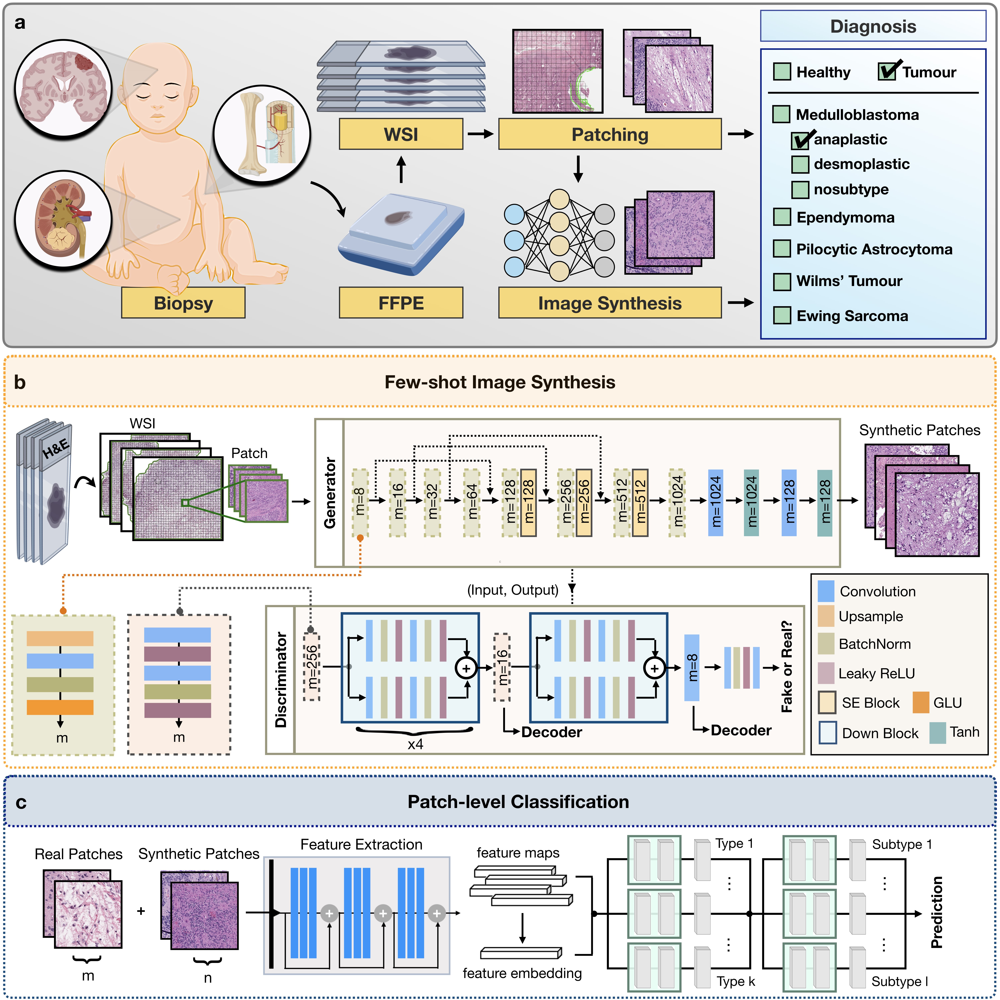

# SCI-AIDE : High-fidelity Few-shot Histopathology Image Synthesis for Rare Cancer Diagnosis
<p align="center">
 
</p>

###  [Pretrained Models]() | [Website](https://deepmia.boun.edu.tr/) 

In this work, we created synthetic tissue microscopy images using few-shot learning and developed a digital pathology pipeline called SCI-AIDE to improve diagnostic accuracy. Since rare cancers encompass a very large group of tumours, we used childhood cancer histopathology images to develop and test our system. Our computational experiments demonstrate that the synthetic images significantly enhances performance of various AI classifiers. 

## Example Results

### Real WSIs and Grad-CAM++ Result


### Real and Synthetic Images


### Synthetic Images Generation Process


## Dataset

The dataset used in this study is derived from the original [Hyper-Kvasir](https://datasets.simula.no/hyper-kvasir/) open-source dataset. UC images were classified according to the Mayo scoring method, which consists of score 0 representing no disease, score 1 representing mild disease, score 2 representing moderate disease, and score 3 representing severe disease.

We introduce new labelled 352 UC endoscopy images from [Hyper-Kvasir](https://datasets.simula.no/hyper-kvasir/) dataset including 98 for grade 0, 93 for grade 1, 91 for grade 2, and 70 for grade 3 were labelled by our experienced gastroenterologists.

The dataset used in this study includes a total of 321 UC endoscopy-labelled images with grade 0, grade 1, grade 2, and grade 3 from original [Hyper-Kvasir](https://datasets.simula.no/hyper-kvasir/) .

Our study contains a total of 673 images from the UC endoscopy images;
- 120 grade 0 
- 212 grade 1 
- 218 grade 2 
- 123 grade 3

WSIs and labelled dataset will be available publicly in soon


## Prerequisites
- Linux (Tested on Red Hat Enterprise Linux 8.5)
- NVIDIA GPU (Tested on Nvidia GeForce RTX 3090 Ti x 4 on local workstations, and Nvidia A100 GPUs on [TRUBA](https://www.truba.gov.tr/index.php/en/main-page/)
- Python (3.9.7), matplotlib (3.4.3), numpy (1.21.2), opencv (4.5.3), openslide-python (1.1.1), openslides (3.4.1), pandas (1.3.3), pillow (8.3.2), PyTorch (1.9.0), scikit-learn (1.0), scipy (1.7.1),  tensorboardx (2.4), torchvision (0.10.1).


### Getting started

- Clone this repo:
```bash
git clone https://github.com/DeepMIALab/Ulcer_grade_classificaiton
cd Ulcer_grade_classificaiton
```

- Install PyTorch 3.7 and other dependencies (e.g., torchvision, visdom, dominate, gputil).

- For pip users, please type the command `pip install -r requirements.txt`.

- For Conda users,  you can create a new Conda environment using `conda env create -f environment.yml`.

### Training and Test

- The image identity numbers which were used in train, validation and test sets are given as .txt files in [docs/](https://github.com/DeepMIALab/AI-FFPE/tree/main/docs) for both Brain and Lung dataset. To replicate the results, you may download [dataset]() and create a subset using these .txt files.

The data used for training are expected to be organized as follows:
```bash
DATASET                
 ├──  train
 |      ├──Grade_0
 |           ├── 1.png     
 |           ├── ...
 |           └── n.png
 |      ├──Grade_1
 |           ├── 1.png     
 |           ├── ...
 |           └── n.png
 |      ├──Grade_2
 |           ├── 1.png     
 |           ├── ...
 |           └── n.png
 |      ├──Grade_3
 |           ├── 1.png     
 |           ├── ...
 |           └── n.png
 ├──  test
 |      ├──Grade_0
 |           ├── 1.png     
 |           ├── ...
 |           └── n.png
 |      ├──Grade_1
 |           ├── 1.png     
 |           ├── ...
 |           └── n.png
 |      ├──Grade_2
 |           ├── 1.png     
 |           ├── ...
 |           └── n.png
 |      ├──Grade_3
 |           ├── 1.png     
 |           ├── ...
 |           └── n.png

```


- Train the UC model:
```bash
python classifer.py --action train --train_data ./dataset/train --test_data ./dataset/test --model_name $MODEL --epoch_number $EPOCH_NUMBER --bs $BATCH_SIZE --lr $LEARNING_RATE
```

- Test the UC model:
```bash
python classifer.py --action test --test_data ./dataset/test --load_from TRAINED_WEIGHT_PATH --model_name $MODEL --epoch_number $EPOCH_NUMBER --bs $BATCH_SIZE --lr $LEARNING_RATE
```

The list of other arguments is as follows:

- --model_name: CNN model name is avaliable in [pytorch-image-models](https://github.com/rwightman/pytorch-image-models/tree/54a6cca27a9a3e092a07457f5d56709da56e3cf5)
-  --scheduler: Learning schedululer selection (CosineAnnealingLR or ReduceLROnPlateau)
-  --optimizer: Optimizers selection ( SGD, Adam or RMSprop )
-  --augmentation_size:


- To view training results and loss plots, run `python -m visdom.server` and click the URL http://localhost:8097.

The test results will be saved to a html file here: ``` ./results/${result_dir_name}/latest_train/index.html ``` 


### Apply a pre-trained UC Grade Classificaiton model and evaluate
For reproducability, you can download the pretrained models for each algorithm [here.]()

## Issues

- Please report all issues on the public forum.

## License

© [DeepMIA Lab](https://deepmia.boun.edu.tr/) This code is made available under the GPLv3 License and is available for non-commercial academic purposes.

## Funding

This work was funded by [TUBITAK](https://www.tubitak.gov.tr/) for International Fellowship for Outstanding Researchers.


## Reference

If you find our work useful in your research or if you use parts of this code please consider citing our paper:

```
@misc{ozyoruk2021deep,
      title={Deep Learning-based Frozen Section to FFPE Translation}, 
      author={Kutsev Bengisu Ozyoruk and Sermet Can and Guliz Irem Gokceler and Kayhan Basak and Derya Demir and Gurdeniz Serin and Uguray Payam Hacisalihoglu and Berkan Darbaz and Ming Y. Lu and Tiffany Y. Chen and Drew F. K. Williamson and Funda Yilmaz and Faisal Mahmood and Mehmet Turan},
      year={2021},
      eprint={2107.11786},
      archivePrefix={arXiv},
      primaryClass={eess.IV}
}
```


### Acknowledgments
Our code is developed based on [pytorch-image-models](https://github.com/rwightman/pytorch-image-models/tree/54a6cca27a9a3e092a07457f5d56709da56e3cf5). We also thank [pytorch-fid](https://github.com/mseitzer/pytorch-fid) for FID computation, and [FastGAN-pytorch](https://github.com/odegeasslbc/FastGAN-pytorch) for the PyTorch implementation of FastGAN used in our single-image translation setting.
